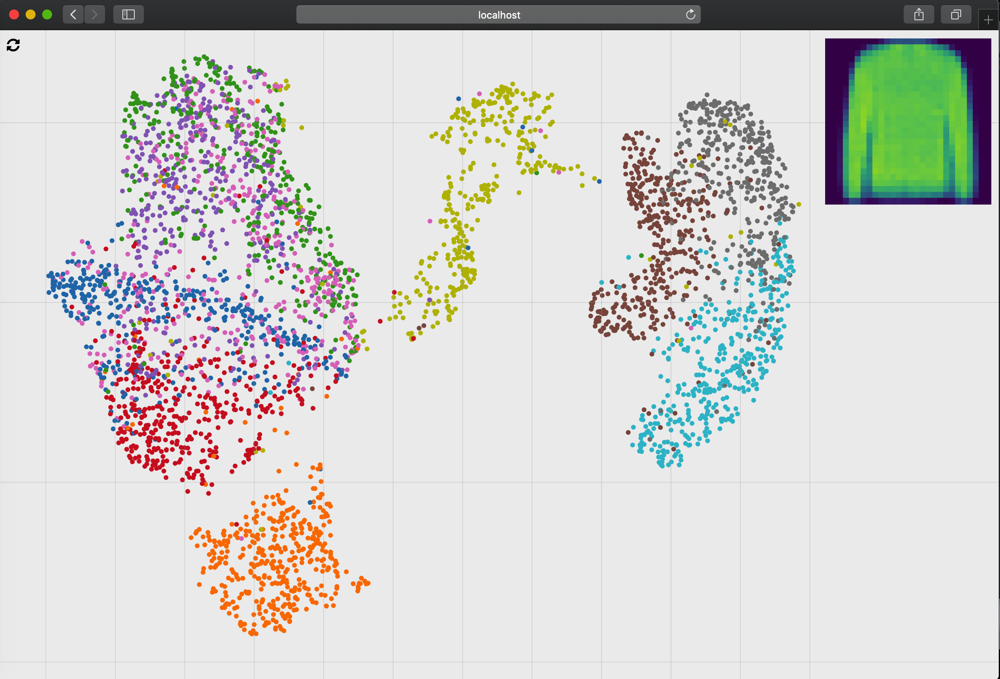

## What is this code about
- The code under /py/ learns an auto-encoder which has an embedding similar to UMAP in the bottleneck layer.
- The code under /html/ shows the resulting decoder in a simple UI.

## How to start a demo
1. Start an HTTP server at /html it should look like:

## How to reproduce a training
1. Run /py/umap-autoencoder.ipynb in jupyter notebook
2. Copy the folder from /py/reconstruct-fashion/ to /html/data
3. Start an HTTP server at /html
